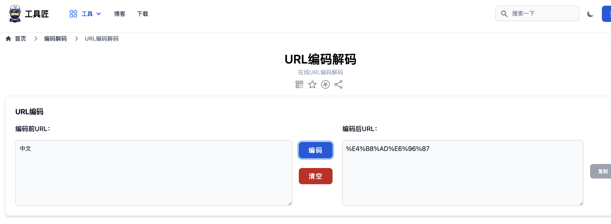

## 问题描述

如果在Android Studio的gradle.properties中定义中文后，那么编译打包后生成的XML文件中会出现乱码，

例如在gradle.properties中定义

>    appName=中文

build.gradle中定义

>    resValue "string", "app_name", app_name

那么在生成的GradleRes.xml文件中的app_name会出现乱码

    
```xml    
    <?xml version="1.0" encoding="utf-8"?>
    <resources>
    
        <!-- Automatically generated file. DO NOT MODIFY -->
    
        <!-- Value from default config. -->
        <string name="app_name" translatable="false">？？？</string>
    
    </resources>
```


## 解决方案

使用过转换文字的编码，但是没有效果，可能和文件本身的编码也有关系

    
> resValue "string", "app_name", new String(app_name.getBytes("iso8859-1"), "UTF-8") 

后来使用的方案使用URLENCODE进行过渡转换。

先把中文名称使用在线工具(<https://www.toolkk.com/tools/url-encode-decode>)进行URLENCODE




然后再gradle.proterties里定义

>    appName=%E4%B8%AD%E6%96%87

修改app\build.gradle里的

    
> resValue "string", "app_name", URLDecoder.decode(app_name.toString(), "UTF-8")

然后，重新编译即可。


